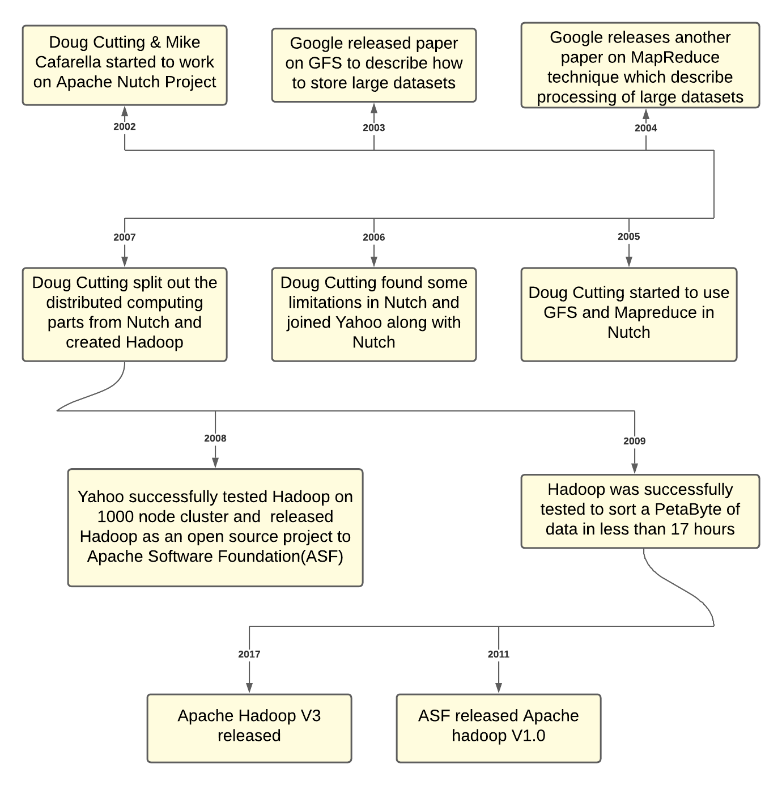
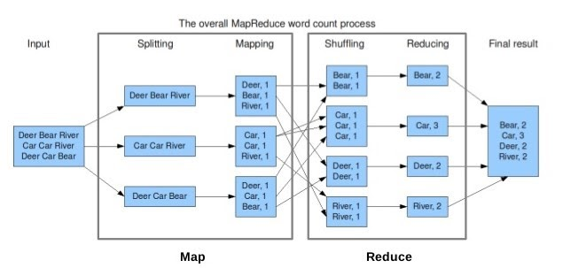

# Hadoopの進化



# Hadoopのアーキテクチャ

1. **HDFS**
    1. Hadoop Distributed File System（HDFS）は、コモディティハードウェア上で動作するように設計された分散ファイルシステムです。既存の分散ファイルシステムと多くの類似点があります。しかし、他の分散型ファイルシステムとの違いは大きい。
    2. HDFSは、耐障害性が高く、低コストのハードウェアに導入できるように設計されています。HDFSはアプリケーションデータへの高スループットのアクセスを提供し、大規模なデータセットを持つアプリケーションに適しています。
    3. HDFSは、[Apache Hadoop Core project](https://github.com/apache/hadoop)の一部です。

    

    1. ネームノード：クラスタ内のファイル名前空間のアービトレーターおよび中央リポジトリです。NameNodeは、ファイルやディレクトリのオープン、クローズ、名前の変更などの操作を実行します。
    2. データノード：動作するノードに接続されたストレージを管理します。すべての読み取りおよび書き込み要求に対応する責任を負います。ブロックの作成、削除、複製など、NameNodeの命令に対する操作を実行します。
    3. クライアント：ネームノードから必要なメタデータを取得し、データノードと通信して読み取りと書き込みを行う責任があります。</br></br></br>

2. **YARN**
    1. YARNとは「Yet Another Resource Negotiator」の略です。Hadoop 1.0で存在していたジョブトラッカーのボトルネックを解消するために、Hadoop 2.0で導入されました。発表当初は「再設計されたリソースマネージャー」と説明されていたが、現在ではビッグデータ処理に用いられる大規模分散型オペレーティングシステムとして知られるようになりました。
    2. YARNアーキテクチャの主な構成要素は以下の通りです。

    

    1. クライアント：リソースマネージャにMap-Reduce(MR)ジョブを投入します。
    2. リソースマネージャー：YARNのマスターデーモンであり、すべてのアプリケーション間のリソースの割り当てと管理を行います。処理要求を受け取ると、それを対応するノードマネージャに転送し、要求を完了するためのリソースを適宜割り当てます。YARNには2つの主要コンポーネントがあります。
    3. スケジューラー：割り当てられたアプリケーションと利用可能なリソースに基づいてスケジューリングを行います。純粋なスケジューラーであるため、モニタリングやトラッキングなどの他のタスクは実行せず、タスクが失敗した場合の再起動も保証しません。YARNのスケジューラーは、クラスターのリソースを分割するためのCapacity SchedulerやFair Schedulerなどのプラグインをサポートしています。
    4. アプリケーションマネージャー：アプリケーションを受け付け、リソースマネージャから最初のコンテナをネゴシエートする役割を担います。また、タスクが失敗した場合、アプリケーション・マネージャ・コンテナを再起動します。
    5. ノードマネージャー：Hadoopクラスター上の個々のノードを管理し、アプリケーションやワークフロー、その特定のノードを管理します。その主な仕事は、ノードマネージャーとの連携を保つことです。リソースの使用状況を監視し、ログ管理を行い、リソースマネージャからの指示に基づいてコンテナを強制終了させます。また、アプリケーション・マスターの要求に応じて、コンテナ・プロセスを作成し、起動する役割も担っています。
    6. アプリケーションマスター：アプリケーションとは、フレームワークに投入される1つのジョブのことです。アプリケーション・マスターは、リソース・マネージャーとのリソースの交渉、ステータスの追跡、単一のアプリケーションの進捗状況の監視を担当します。アプリケーションマスターは、アプリケーションの実行に必要なものをすべて含んだContainer Launch Context(CLC)を送信することで、ノードマネージャーにコンテナを要求します。アプリケーションが起動すると、随時、リソースマネージャにヘルスレポートを送信します。
    7. コンテナ：1つのノード上にRAM、CPUコア、ディスクなどの物理リソースを集めたものです。コンテナは、環境変数、セキュリティトークン、依存関係などの情報を含むレコードであるContainer Launch Context(CLC)によって起動されます。</br></br>


# MapReduceフレームワーク


1. MapReduceという用語は、Hadoopプログラムが実行する2つの独立した異なるタスク-MapジョブとReduceジョブ-を表しています。Mapジョブは入力としてデータセットを受け取り、それらを処理してキーと値のペアを生成します。Reduceジョブは、Mapジョブの出力、すなわちキーバリューペアを受け取り、必要な結果を得るためにそれらを集約します。
2. Hadoop MapReduce（Hadoop Map/Reduce）は、大規模なデータセットをコンピューティングクラスター上で分散処理するためのソフトウェアフレームワークです。MapReduceは入力されたデータセットをいくつかのパーツに分割し、すべてのデータパーツに対して一度に並列してプログラムを実行するのに役立ちます。
3. MapReduceフレームワークの使用方法を示すワードカウントの例を以下に示します。


</br></br>

# その他のHadoop周りのツール

1. [**Hive**](https://hive.apache.org/)
    1. HQLと呼ばれるSQLライクな言語を使用します。プログラマーではない人でもHadoopのデータを照会・分析できるようにします。 基本的にはmap-reduceの上の抽象化レイヤーです。
    2. 例：HQLクエリ
        1. _SELECT pet.name, comment FROM pet JOIN event ON (pet.name = event.name);_
    3. mysqlの場合：
        1. _SELECT pet.name, comment FROM pet, event WHERE pet.name = event.name;_
2. [**Pig**](https://pig.apache.org/)
    1. Pig Latinと呼ばれるスクリプト言語を使用しており、よりワークフローを重視しています。 Javaプログラマーである必要はありませんが、多少のコーディングスキルは必要です。 map-reduceの上の抽象化レイヤーでもあります。
    2. ここで簡単な質問です：
    下の画像の左の列にあるデータに対して、右の列のPigクエリを実行すると、どのような出力になりますか？

    

    出力を見てみましょう：

    ```
    7,Komal,Nayak,24,9848022334,trivendram
    8,Bharathi,Nambiayar,24,9848022333,Chennai
    5,Trupthi,Mohanthy,23,9848022336,Bhuwaneshwar
    6,Archana,Mishra,23,9848022335,Chennai
    ```

3. [**Spark**](https://spark.apache.org/)
    1. Sparkは、インメモリで分散コンピューティングを行うためのプリミティブを提供しており、ユーザープログラムがデータをクラスターのメモリにロードして繰り返しクエリを行うことができるため、機械学習アルゴリズムに適しています。
4. [**Presto**](https://prestodb.io/)
    1. Prestoはビッグデータ用の高性能な分散型SQLクエリエンジンです。
    2. そのアーキテクチャにより、ユーザーはHadoop、AWS S3、Alluxio、MySQL、Cassandra、Kafka、MongoDBなどの様々なデータソースにクエリを実行できます。
    3. Prestoクエリの例：
    ```
    use studentDB;
    show tables;
    SELECT roll_no, name FROM studentDB.studentDetails where section=’A’ limit 5;
    ```
</br>

# データのシリアライズとストレージ

1. データをネットワークで転送したり、永続的なストレージに保存したりするために、データ構造やオブジェクトの状態をバイナリやテキストの形式に変換するプロセスを使用します。このプロセスをシリアライズと呼びます。
2. Avroデータはコンテナファイル（.avro ファイル）に格納され、そのスキーマ（.avsc ファイル）はデータファイルと一緒に格納されます。
3. Apache HiveはテーブルをAvro形式で保存する機能を備えており、このシリアライゼーションフォーマットのデータに対してクエリすることもできます。
