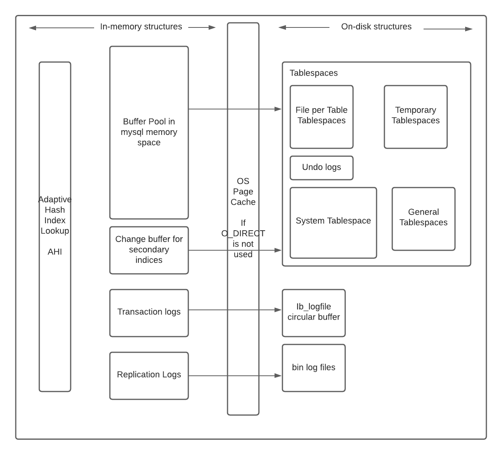

### なぜInnoDBを使うべきなのか？

汎用性、行レベルのロック、ACIDサポート、トランザクション、クラッシュリカバリー、マルチバージョン同時実行制御など。

### アーキテクチャ

### 主要なコンポーネント

* メモリ：
    * バッファプール：使用頻度の高いデータ（テーブルやインデックス）をLRUキャッシュし、メモリから直接処理することで処理を高速化します。パフォーマンスのチューニングで重要になります。
    * 変更バッファ：セカンダリインデックスページの変更をバッファプールにないときにキャッシュし、ページがフェッチされたときにマージします。マージには長い時間がかかり、ライブクエリに影響を与える可能性があります。また、バッファプールの一部を占有します。セカンダリインデックスを読み込むための余分なI/Oを回避することができます。
    * 適応型ハッシュインデックス（AHI）：InnoDBのB-Treeインデックスを、キャッシュのような高速ハッシュルックアップテーブルで補完します。ミスした場合にはわずかにパフォーマンスが低下し、それを更新するためのメンテナンスのオーバーヘッドも発生します。ハッシュの衝突は、大きなDBではAHIの再構築を引き起こします。
    * ログバッファ：ログバッファ：ディスクにフラッシュする前のログデータを保持します。

      上記メモリのサイズは設定可能で、パフォーマンスに大きな影響を与えます。最適なパフォーマンスを得るためには、ワークロードや利用可能なリソースを慎重に分析し、ベンチマークやチューニングを行う必要があります。

* ディスク：
    * テーブル：行と列にデータを格納する。
    * インデックス：特定の列の値を持つ行を迅速に見つけることができ、テーブルのフルスキャンを避けることができます。
    * REDOログ：すべてのトランザクションはログに書き込まれ、クラッシュの後、リカバリプロセスは不完全なトランザクションによって書き込まれたデータを修正し、保留中のトランザクションを再生します。
    * UNDOログ：1つのトランザクションに関連する記録で、トランザクションによる最新の変更を元に戻す方法に関する情報が含まれます。

