# Linuxサーバー管理

このコースでは、Linuxサーバー管理者が行う一般的なタスクをいくつか取り上げます。まず、コマンドが何をするのかを理解してから、例題を使ってコマンドを理解していきます。Linuxコマンドを自分で練習することは非常に重要であることを覚えておいてください。

## ラボ環境のセットアップ

- お使いのシステムにDockerをインストールしてください - [https://docs.docker.com/engine/install/](https://docs.docker.com/engine/install/)

- ここでは、Red Hat Enterprise Linux (RHEL) 8システムですべてのコマンドを実行します。

  

- このモジュールで使用するコマンドのほとんどを、上記のDockerコンテナで実行します。

## マルチユーザーオペレーティングシステム

オペレーティングシステムは、複数の人やユーザーがコンピュータを使用しても、互いのファイルや設定に影響を与えないようになっていれば、マルチユーザーとみなされます。Linuxベースのオペレーティングシステムは、複数のユーザーが同時にシステムにアクセスすることができるため、マルチユーザーとしての性質を持っています。一般的なコンピュータには1つのキーボードとモニターしかありませんが、コンピュータがネットワークに接続されていれば、複数のユーザーがSSHでログインすることができます。SSHについては後で詳しく説明します。

サーバー管理者としては、物理的に非常に離れた場所に存在するLinuxサーバーが主な対象となります。このようなサーバにーは、SSHなどのリモートログイン方法を使って接続します。

Linuxは複数のユーザーをサポートしているので、ユーザーをお互いに保護する方法が必要です。あるユーザーが他のユーザーのファイルにアクセスしたり変更したりできないようにする必要があります。

## ユーザー/グループ管理

- Linuxのユーザーには、UIDと呼ばれるユーザーIDが関連付けられています。

- また、ユーザーにはホームディレクトリとログインシェルが関連付けられています。

- グループは、1人または複数のユーザーの集まりです。グループを使うことで、ユーザーグループ間での権限の共有が容易になります。

- 各グループにはGIDと呼ばれるグループIDが関連付けられています。

### id コマンド

`id`コマンドは、ユーザーに関連するUIDとGIDを調べることができます。
また、そのユーザーが所属しているグループの一覧も表示されます。

rootユーザーのUIDとGIDは0です。

Linuxで現在のユーザーを調べるには、whoamiコマンドを使います。

**「root」ユーザーまたはスーパーユーザーは、最も権限のあるユーザーで、システム上のすべてのリソースに無制限にアクセスできます。UIDは0です。**

### ユーザー/グループに関連する重要なファイル
| ファイル名 | 説明
| -------------| --------------------------------------------------------------------------------- |
| /etc/passwd | ユーザー名、UID、GID、ホームディレクトリ、ログインシェルなどを格納する |
| /etc/shadow | ユーザーに関連するパスワードを格納する |
| /etc/group | システム上のさまざまなグループに関する情報を格納する |

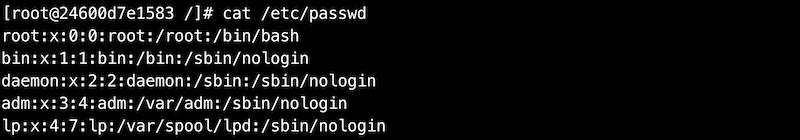

上記の出力で説明されている各ファイルを理解したい場合は、以下のリンクを参照してください。

- [https://tldp.org/LDP/lame/LAME/linux-admin-made-easy/shadow-file-formats.html](https://tldp.org/LDP/lame/LAME/linux-admin-made-easy/shadow-file-formats.html)

- [https://tldp.org/HOWTO/User-Authentication-HOWTO/x71.html](https://tldp.org/HOWTO/User-Authentication-HOWTO/x71.html)

## ユーザー管理のための重要なコマンド

Linux でユーザーやグループを管理するために頻繁に使用されるコマンドは以下のとおりです。

- `useradd` - 新しいユーザを作成する

- `passwd` - ユーザーのパスワードを追加または変更する

- `usermod` - ユーザーの属性を変更する

- `userdel` - ユーザーを削除する

### useradd

Linuxではuseraddコマンドで新しいユーザーを追加します。

ここでは、新しいユーザー「shivam」を作成します。また、/etc/passwdファイルをtailしてユーザーが作成されたことを 確認します。新たに作成されたユーザーのUIDとGIDには1000が割り当てられています。このユーザーに割り当てられたホームディレクトリは/home/shivam、ログインシェルは/bin/bashとなっています。ユーザーのホームディレクトリやログインシェルは後から変更することができます。

ホームディレクトリやログインシェルなどの属性に値を指定しない場合は、デフォルト値がユーザーに割り当てられます。また新しいユーザーを作成する際に、これらのデフォルト値を上書きすることもできます。

### passwd

passwd コマンドは、ユーザーのパスワードを作成または変更するために使用します。

上記の例では、ユーザー「shivam」「amit」にパスワードを割り当てていません。

shadow内のアカウントエントリの「!!」は、あるユーザーのアカウントが作成されたが、まだパスワードが与えられていないことを意味します。

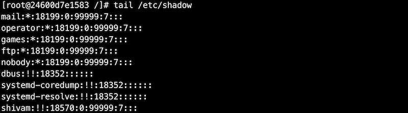

それでは、ユーザー「shivam」のパスワードを作成してみましょう。

このパスワードを覚えておいてください。

また、今度はrootユーザーのパスワードを変更してみましょう。通常のユーザーからrootユーザーに切り替えると、パスワードの入力を求められます。
また、rootユーザーでログインするときにも、パスワードを聞かれます。

### usermod

usermodコマンドは、ホームディレクトリやシェルなど、ユーザーの属性を変更するために使用します。

ここでは、ユーザー「amit」のログインシェルを「/bin/bash」に変更してみます。

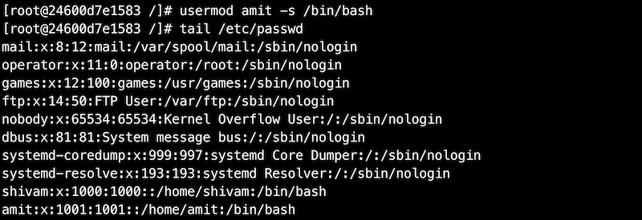

同様に、ユーザーの他の多くの属性を変更することもできます。
「usermod -h」を実行すると、変更できる属性の一覧が表示されます。

### userdel

Linux でユーザーを削除するには userdel コマンドを使用します。ユーザーを削除すると、そのユーザーに関連するすべての情報が削除されます。

ここでは、ユーザー 「amit 」を削除してみます。ユーザーを削除すると、「/etc/passwd」や「/etc/shadow」ファイルにからユーザーのエントリがなくなります。

## グループ管理のための重要なコマンド

グループを管理するためのコマンドは、ユーザーを管理するためのコマンドとよく似ています。それぞれのコマンドはよく似ているので、ここでは詳しく説明しません。以下のコマンドを実行してみてください。

| コマンド名 | 説明 |
| ------------------------ | ------------------------------- |
| groupadd <グループ名\> | 新しいグループを作成する |
| groupmod <グループ名\> | グループの属性を変更する |
| groupdel <グループ名\> | グループを削除する |
| gpasswd <グループ名\> | グループのパスワードを変更する |

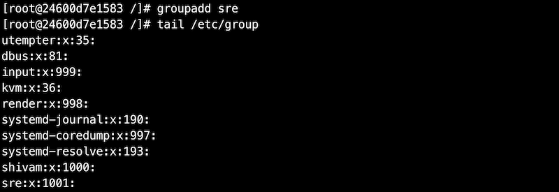

それでは、先ほど作成したグループにユーザー「shivam」を追加してみます。

## スーパーユーザーになる

**以下のコマンドを実行する前に、ユーザー "shivam "にパスワードが設定されていることを確認してください。
ユーザー "shivam "とユーザー "root "にパスワードを設定してください。
でパスワードを設定してください。

Linuxでは、suコマンドを使ってユーザーを切り替えることができます。ここでは
ユーザー "shivam "に切り替えてみましょう。

それでは、「/etc/shadow」ファイルを開いてみましょう。

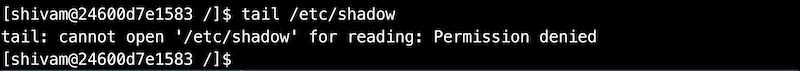

オペレーティングシステムは、ユーザー「shivam」に「/etc/shadow」の内容を読むことを許可しませんでした。
/etc/shadow」ファイルの内容を読むことができませんでした。これはユーザーのパスワードを保存するLinuxの重要なファイルです。このファイルにアクセスできるのは、rootまたはスーパーユーザーの権限を持つユーザーのみがアクセスできます。

**sudoコマンドは、rootユーザーのセキュリティ権限でコマンドを実行することができます。**システム上のすべての権限を持っていることを忘れないでください。また、suコマンドを使ってrootユーザーに切り替え、上記のファイルを開くこともできます。ルートユーザーに切り替えて上記のファイルを開くこともできますが、その際にはルートユーザーのパスワードが必要になります。別の方法として、最近のオペレーティングシステムでは、sudoコマンドを使用してスーパーユーザーになる方法もあります。この方法では、ユーザーは自分のパスワードを入力する必要があり、かつsudoグループに所属している必要があります。

**他のユーザーにスーパー権限を与えるには？**

まず、suコマンドでルートユーザーになりましょう。以下のコマンドを使うとルートユーザーのパスワードを入力する必要があります。

ルートユーザーのパスワードを設定し忘れた場合は、「exit」と入力してください。rootユーザーに戻ります。パスワードを設定するにはpasswdコマンドを使います。

**ファイル /etc/sudoers には、sudo の起動を許可されたユーザーの名前が記録されています。**Red Hatのオペレーティングシステムでは、このファイルはデフォルトでは存在しません。。sudoをインストールする必要があります。

yumコマンドについては、後のセクションで詳しく説明します。

システム上の「/etc/sudoers」ファイルを開いてみてください。このファイルにはたくさんの情報が含まれています。このファイルには、ユーザーがsudoコマンドを実行する際に従わなければならないルールが保存されています。例えば、rootはどこからでもどんなコマンドでも実行できます。

ユーザーにroot権限を与える簡単な方法の一つは、すべてのコマンドを実行する権限を持つグループに追加することです。Red Hat Linuxにおいて、「wheel」はそのような権限を持つグループです。

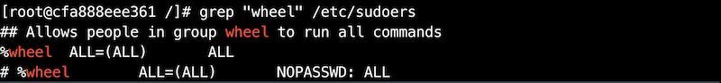

ユーザー「shivam」をこのグループに追加して、sudoの権限も持つようにしてみましょう。

ユーザー「shivam」に戻って、「/etc/shadow」ファイルにアクセスしてみましょう。

sudo権限でしかアクセスできないため、コマンドを実行する前にsudoを使用する必要があります。ユーザー「shivam」にsudo権限を与えています。先ほどすでに、ユーザー「shivam」をグループ「wheel」に追加して、sudo権限を与えています。

## ファイルパーミッション

Linuxオペレーティングシステムでは、各ファイルやディレクトリには、ファイルの所有者、関連するユーザーのグループのメンバー、その他のすべての人のためのアクセス許可が割り当てられています。これは、あるユーザーが他のユーザーのファイルやリソースにアクセスできないようにするためです。

ファイルのパーミッションを見るには、lsコマンドを使います。ここではetc/passwdファイルのパーミッションを見てみましょう。

ファイルのパーミッションに関連する重要なフィールドを見てみましょう。

### chmodコマンド

Linuxでは、ファイルやディレクトリのパーミッションを変更するためにchmodコマンドを使用します。

chmodコマンドは、パーミッションを数値引数で受け取ります。パーミッションは一連のビットと考えることができ、1はTrue、つまり許可されていることを表し、0はFalse、つまり許可されていないことを表します。

| パーミッション         | rwx | 2進数 | 10進数 |
| -------------------- | --- | ---- | ----- |
| 読み取り、書き込み、実行 | rwx | 111  | 7     |
| 読み取り、書き込み      | rw- | 110  | 6     |
| 読み取り、実行         | r-x | 101  | 5     |
| 読み取りのみ           | r-- | 100  | 4     |
| 書き込み、実行         | -wx | 011  | 3     |
| 書き込みのみ           | -w- | 010  | 2     |
| 実行のみ              | --x | 001  | 1     |
| なし                  | --- | 000  | 0     |

新しいファイルを作成し、そのファイルのパーミッションを確認してみます。

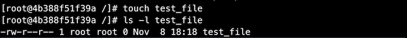

グループオーナーには、このファイルへの書き込み権限がありません。それではchmodコマンドを使って、グループオーナーまたはrootに書き込み権限を与えましょう。

chmodコマンドは、同様の方法でディレクトリのパーミッションを変更することもできます。
### chownコマンド

chownコマンドは、Linuxでファイルやディレクトリの所有者を変更するために使用します。

コマンドの構文：`chown <新しい所有者> <ファイル名>`

**sudo権限を持っていない場合は、コマンドを使用する必要があります。**ユーザー「shivam」に切り替えて、オーナーを変更してみましょう。また、下記のコマンドを実行する前に、ファイルのオーナーをrootに変更しています。

chownコマンドは、同様の方法でディレクトリのオーナーを変更することもできます。

### chgrpコマンド

chgrpコマンドを使用して、ファイルやディレクトリのグループ所有権を変更することができます。構文はchownコマンドとよく似ています。

chgrpコマンドは、同様にディレクトリの所有者を変更するのにも使用できます。

## SSHコマンド

sshコマンドは、リモートシステムにログインしたり、システム間でファイルを転送したり、リモートマシンでコマンドを実行したりするのに使われます。SSHはsecure shellの略で、インターネットのような安全でないネットワーク上で、2つのホスト間に暗号化された安全な接続を提供するために使用されます。

参考:
[https://www.ssh.com/ssh/command/](https://www.ssh.com/ssh/command/)

ここでは、安全で最も一般的なssh認証であるパスワードレス認証について説明します。

### SSHによるパスワードレス認証

この方法では、パスワードを入力せずにホストにログインすることができます。また、スクリプトでssh関連の作業を行いたい場合にも便利です。

パスワードレス認証では、公開鍵と秘密鍵のペアを使用する必要があります。その名が示すように、公開鍵は誰とでも共有できますが、秘密鍵は秘密にしておく必要があります。
この認証がどのように機能するかの詳細については、ここでは触れません。詳しくは[こちら](https://www.digitalocean.com/community/tutorials/understanding-the-ssh-encryption-and-connection-process)をご覧ください。

リモートホストとのパスワードレス認証を設定する手順:

1. 公開鍵と秘密鍵のペアを作成する

    **すでに鍵ペアが\~/.sshディレクトリに保存されている場合は、再度鍵を生成する必要はありません。**

    opensshパッケージをインストールします。opensshパッケージには、sshに関するすべてのコマンドが含まれています。

    

    ssh-keygenコマンドを使って、鍵ペアを生成します。すべてのプロンプトでデフォルト値を選択できます。

    

    ssh-keygenコマンドが正常に実行されると、2つの鍵が\~/.sshディレクトリに存在することが確認できます。id_rsa は秘密鍵であり、id_rsa.pub は、公開鍵です。秘密鍵は、自分自身でしか読み取りや変更ができないことに注意してください。

    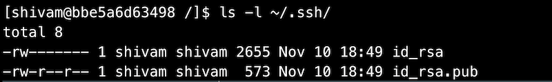

2. 公開鍵をリモートホストに転送する

    公開鍵をリモートサーバーに転送するには、複数の方法があります。
    ここでは、最も一般的な方法の一つであるssh-copy-idコマンドを使用する方法を見てみましょう。

    

    ssh-copy-idコマンドを使用するために、openssh-clientsパッケージをインストールします。

    

    ssh-copy-idコマンドを使って、自分の公開鍵をリモートホストにコピーします。

    

    今度は、パスワード認証を使ってリモートホストにsshします。

    

    これで、公開鍵が ~/.ssh/authorized_keys にあるはずです。

    

    ~/.ssh/authorized_keyには、公開鍵のリストが入っています。この公開鍵に関連付けられているユーザーは、リモートホストへのsshアクセスが可能です。

### リモートホストでコマンドを実行するには?

一般的な構文： `ssh <ユーザー名>@<ホスト名|ホストIP> <コマンド>`

### あるホストから別のホストにファイルを転送するには？

一般的な構文: `scp <ソースファイル> <転送先>`

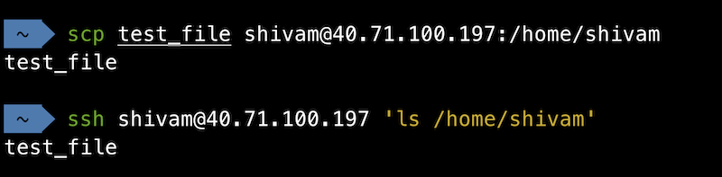

## パッケージ管理

パッケージ管理とは、ソフトウェアをシステムにインストールして管理するプロセスです。必要なパッケージをLinuxのパッケージディストリビュータからインストールします。ディストリビューターによって異なるパッケージシステムを使用しています。
  
| パッケージングシステム | ディストリビューション |
| ---------------------- | ------------------------------------------ |
| Debian スタイル (.deb) | Debian, Ubuntu |
| Debian style (.deb) | Debian, Ubuntu | Red Hat style (.rpm) | Fedora, CentOS, Red Hat Enterprise Linux |

**Linuxにおける一般的なパッケージシステム**。

|コマンド | 説明 |
| ----------------------------- | -------------------------------- |
| yum install <パッケージ名>      | パッケージをシステムにインストールする |
| yum update <パッケージ名>       | パッケージを最新のバージョンに更新する |
| yum remove <パッケージ名>       | パッケージをシステムから削除する      |
| yum search <パッケージ名>       | 特定のキーワードで検索する           |

[DNF](https://docs.fedoraproject.org/en-US/quick-docs/dnf/)は、Fedoraでパッケージのインストールと管理に使われているYUMの後継です。DNF は、将来的にはRPMベースのすべてのLinuxディストリビューションでYUMを置き換えるかもしれません。

yum searchコマンドで検索したところ、httpdというキーワードに完全に一致するものが見つかりました。それでは、httpdパッケージをインストールしてみましょう。

httpdがインストールされたら、yum removeコマンドを使ってhttpdパッケージを削除します。

## プロセス管理

このセクションでは、Linuxシステムのプロセスを監視するのに便利なコマンドをいくつか紹介します。
このセクションでは、Linux システムのプロセスを監視するために使用できる便利なコマンドについて学びます。

### ps (process status)

psコマンドは、プロセスの情報やプロセスのリストを知るために使用します。

psコマンドの実行中に「ps command not found」というエラーが発生した場合は**procps**パッケージをインストールしてください。

引数なしのpsはあまり役に立ちません。システム上のすべてのプロセスをリストアップしてみましょう。

参考:
[https://unix.stackexchange.com/questions/106847/what-does-aux-mean-in-ps-aux](https://unix.stackexchange.com/questions/106847/what-does-aux-mean-in-ps-aux)

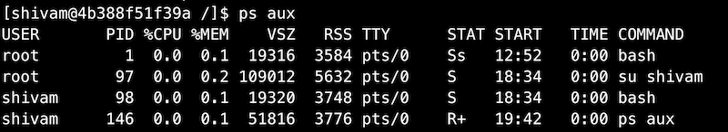

psコマンドに追加の引数を使用することで、特定のプロセスIDを指定して、そのプロセスの情報を表示することができます。

psコマンドにgrepを併用することで、特定のプロセスのみをリストアップすることができます。

### top

topコマンドは、システム上で実行されているLinuxプロセスの情報をリアルタイムで表示します。また、システム情報の概要を表示します。

各プロセスについて、topはプロセスID、所有者、優先度、状態、CPU使用率、メモリ使用率、その他多くの情報が表示されます。また、システム全体のメモリ使用率やCPU使用率、システムの稼働時間やCPU負荷の平均値なども表示されます。
## メモリ管理

このセクションでは、システムのメモリに関する情報を表示するための便利なコマンドについて説明します。

### free

freeコマンドは、システムのメモリ使用量を表示するために使用します。このコマンドは、RAM上の空き領域と使用領域の合計と、キャッシュ／バッファが占める領域を表示します。

freeコマンドは、デフォルトではメモリ使用量をキロバイト単位で表示します。追加の引数を使用して、人間が読みやすい形式でデータを得ることができます。

### vmstat

vmstatコマンドを使用すると、メモリ使用量に加えて、ioやcpuの使用率などの情報を表示することができます。

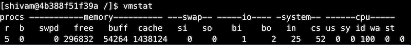

## ディスク容量の確認

このセクションでは、Linuxでディスクの空き容量を確認するのに便利なコマンドを紹介します。
### df (disk free)

dfコマンドは、マウントされているファイルシステムごとに空き容量と利用可能容量を表示します。

### du (disk usage)

duコマンドは、システム上のファイルやディレクトリのディスク使用量を表示します。

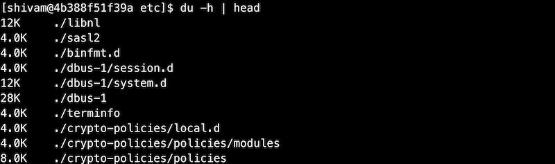

以下のコマンドを実行すると、ルートディレクトリ内の上位5つのディレクトリを表示します。

## デーモン

バックグラウンドプロセスとして動作するコンピュータプログラムをデーモンと呼びます。伝統的に、デーモンプロセスの名前はdで終わります（sshd、httpdなど）。デーモンプロセスはバックグラウンドで実行されるため、ユーザーはデーモンプロセスと対話することはできません。

サービスとデーモンは、ほとんどの場合同じ意味で使用されます。

## systemd

systemdは、Linux オペレーティングシステムのシステムおよびサービスマネージャです。
ユニットはsystemdの構成要素です。これらのユニットはユニット設定ファイルで表されます。

以下の例は、RPMで配布されている/usr/lib/systemd/systemにあるユニット設定ファイルを示しています。これらはインストールされたRPMパッケージによって配布されています。
ここでは、serviceで終わる設定ファイルがサービスユニットであることに注目します。

### システムサービスの管理

サービスユニットのファイル拡張子は.serviceです。systemdが管理しているサービスの起動、停止、再起動には、systemctlコマンドを使用します。

| コマンド | 説明 |
| ------------------------------- | -------------------------------------- |
| systemctl start name.service | サービスを開始する |
| systemctl stop name.service | サービスを停止する |
| systemctl restart name.service | サービスを再起動する |
| systemctl status name.service | サービスの状態を確認する |
| systemctl reload name.service | サービスの設定を再読み込みする |

## ログ 

このセクションでは、Linuxのシステムログやアプリケーションログの閲覧に役立つ重要なファイルやディレクトリについて説明します。これらのログは、システムのトラブルシューティングを行う際に非常に役立ちます。

| ファイル／ディレクトリ | 説明 |
| ------------------------------- | -------------------------------------- |
| /var/log/* | システムログに加えて、デーモンプロセスに関連するログを格納します。 var/logディレクトリにある重要なログファイルは以下の通りです。  ・var/log/messages - システムエラー、システムの起動と終了、システム構成の変更などに関するログが含まれます。 ・/var/log/authlog - システムの認証に関するログが含まれています。   ・/var/log/lastlog - 全ユーザーの最近のログイン情報が含まれています |
| dmesg | カーネルのログを表示します https://ja.wikipedia.org/wiki/Dmesg |