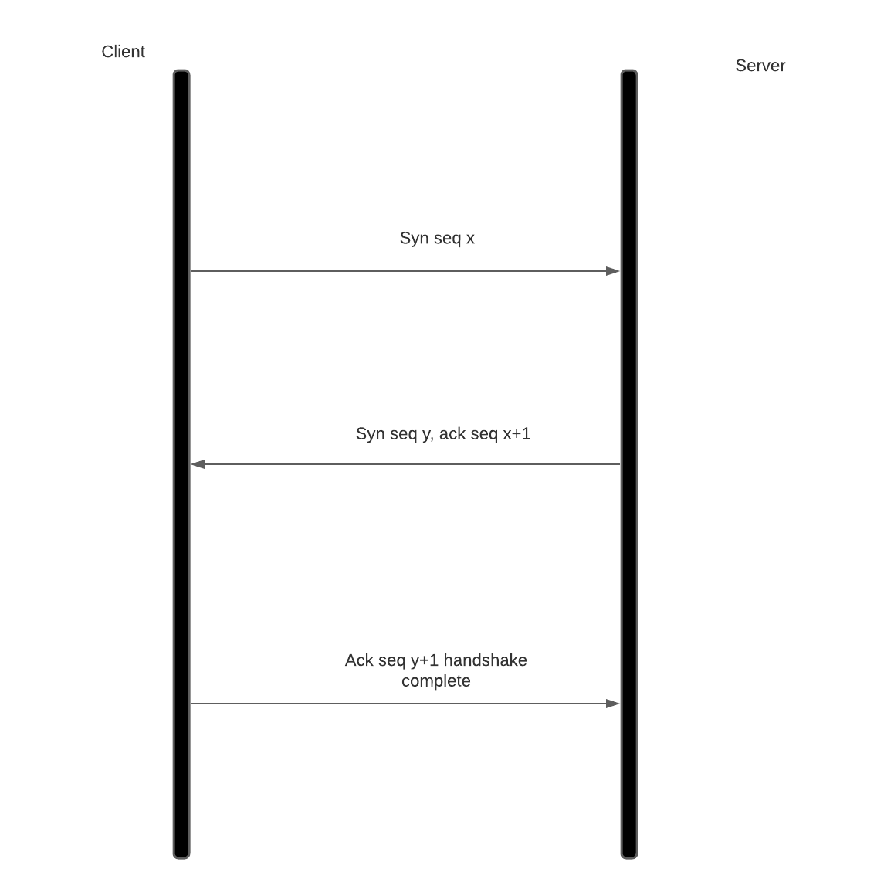
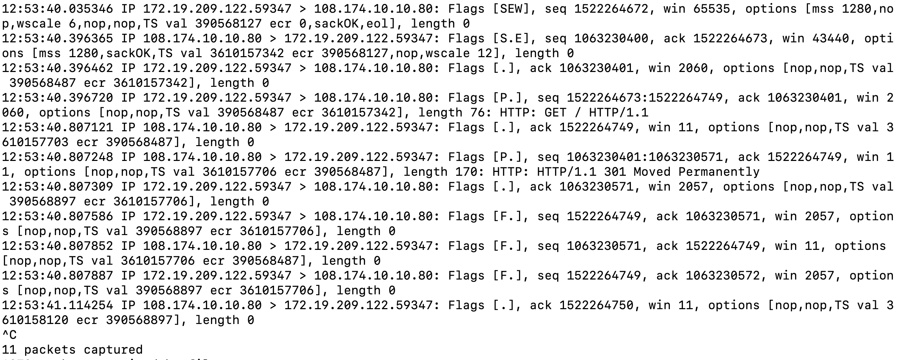
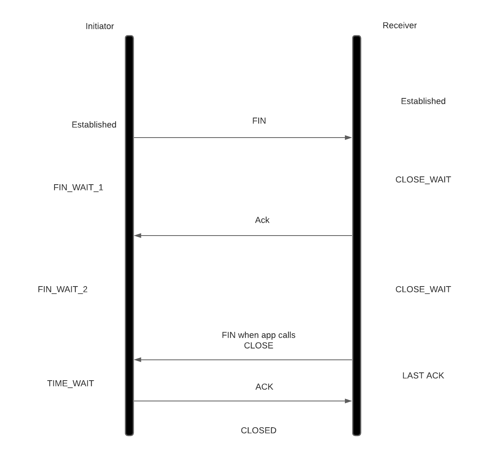

# TCP

TCPはUDPと同じトランスポート層のプロトコルですが、信頼性、フロー制御、輻輳制御を保証します。
TCPはシーケンス番号を用いて信頼性の高い配信を保証します。TCPの接続は、3ウェイハンドシェイクによって確立されます。このケースでは、クライアントがSYNパケットを使用する予定の開始シーケンス番号と共に送信し、サーバーはSYNパケットを確認して、そのシーケンス番号を添えたSYNを送信します。クライアントがSYNパケットを確認すると、接続が確立されます。以降、転送される各データは、そのシーケンスに対する確認応答を関係者が受け取った時点で、確実に配信されたとみなされます。



```bash
#ハンドシェイクを理解するために、あるbashセッションでパケットキャプチャを実行します
tcpdump -S -i any port 80
#bashセッションでcurlを実行します
curl www.linkedin.com
```




ここでは、クライアントが[S]フラグで示されるSYNフラグをシーケンス番号1522264672と共に送信しています。サーバはSYNの受信をACK[.]フラグとシーケンス番号[S]のSYNフラグで確認します。サーバーはシーケンス番号1063230400を使用し、シーケンス番号1522264673（クライアントシーケンス+1）を期待していることをクライアントに通知します。クライアントはゼロ長の確認応答パケットをサーバーに送信し（サーバーシーケンス+1）、接続が確立します。これを3ウェイハンドシェイクと呼びます。クライアントはこの後、76バイト長のパケットを送信し、シーケンス番号を76だけインクリメントします。サーバーは170バイトのレスポンスを送り、コネクションを閉じます。これが、先ほどのHTTP/1.1とHTTP/1.0の違いです。HTTP/1.1では、この同じ接続を再利用することで、HTTPリクエストごとの3ウェイハンドシェイクのオーバーヘッドを減らすことができます。また、クライアントとサーバーの間でパケットが欠落した場合、サーバーはクライアントにACKを送信せず、クライアントはACKを受信するまでパケットの送信を再試行します。これにより、信頼性が保証されます。
フロー制御は、各セグメントのwin sizeフィールドによって確立されます。winサイズは、受信したセグメントのバッファリングに使用できる、カーネル内の利用可能なTCPバッファの長さを示します。winサイズが0の場合、受信側のソケットバッファからの遅延が大きく、送信側は受信側が対応できるようにパケットの送信を一時停止しなければなりません。このフロー制御は、遅い受信者と速い送信者の問題を防ぎます。

また、TCPは輻輳制御も行います。輻輳制御では、どれだけ多くのセグメントがACKなしで通過できるかを決定します。Linuxでは輻輳制御のアルゴリズムを設定することができますが、ここでは説明しません。

接続を閉じるとき、クライアント/サーバーはcloseシステムコールを呼び出します。ここでは、クライアントがそれを行ったと仮定します。クライアントのカーネルはFINパケットをサーバーに送信します。サーバーのカーネルは、サーバーアプリケーションがcloseシステムコールを呼び出すまで、接続を閉じることができません。サーバーアプリケーションがcloseを呼び出すと、サーバーもFINパケットを送信し、クライアントは2*MSS(120s)の時間待ち状態に入り、その間はこのソケットが再利用されないようにして、行き先のない古いパケットによってTCPの状態が壊れるのを防ぎます。



TCPとHTTPの知識を身につけて、SREがどのように使用するかを見てみましょう。

## SREの役割における応用
1. ロードバランサーを使用してHTTPのパフォーマンスをスケーリングするには、TCPとHTTPの両方に関する一貫した知識が必要です。ロードバランサーには、L4ロードバランサー、L7ロードバランサー、DSRなどの[異なる種類のロードバランサー](https://blog.envoyproxy.io/introduction-to-modern-network-load-balancing-and-proxying-a57f6ff80236?gi=428394dbdcc3)があります。HTTPのオフロードは、パフォーマンスとコンプライアンスのニーズに基づいて、ロードバランサー上で行うことも、サーバーに直接行うこともできます。
2. UDPのパートで行ったように、rmemとwmemのシステムコール変数を調整することで、送信者と受信者のスループットを向上させることができます。
3. システムコール変数tcp_max_syn_backlogとソケット変数somax_connは、アプリケーションがacceptシステムコールを呼び出す前に、カーネルが3ウェイハンドシェイクを完了できる接続数を決定します。これはシングルスレッドのアプリケーションでは非常に便利です。バックログが一杯になると、アプリケーションがacceptシステムコールを呼び出すまで、新しい接続はSYN_RCVD状態（netstatを実行したとき）になります。
4. あまりにも多くの短命な接続があると、アプリケーションはファイルディスクリプタを使い果たしてしまいます。[tcp_reuse and tcp_recycle](http://lxr.linux.no/linux+v3.2.8/Documentation/networking/ip-sysctl.txt#L464)を調べると、時間待ち状態の時間を短縮することができます(それなりのリスクがあります)。また、アプリケーションがその場限りの接続を行うのではなく、プールされた接続を再利用することも有効です。
5. メトリクスを見てパフォーマンスのボトルネックを理解し、アプリケーション側の問題なのか、ネットワーク側の問題なのかを分類します。例えば、Close_wait状態のソケットが多いのはアプリケーションの問題であり、再送はアプリケーション自体よりもネットワークやOSスタックの問題である可能性があります。基本的なことを理解することで、ボトルネックがどこにあるかを絞り込むことができます。

