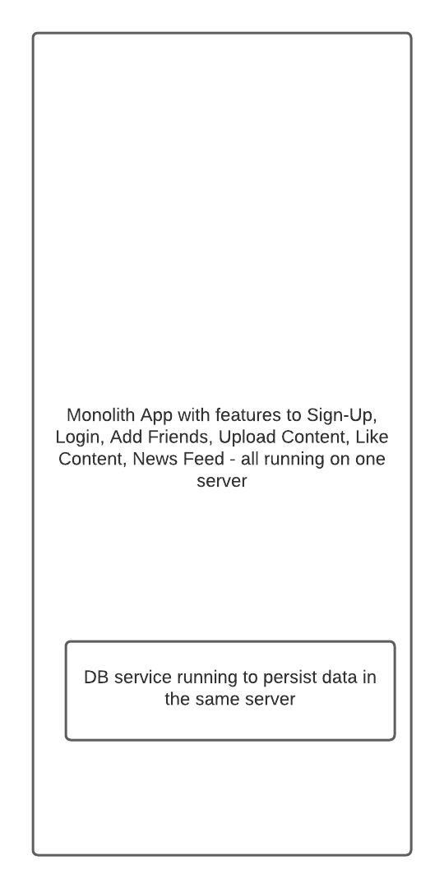

# システム設計

## 前提条件

一般的なソフトウェアシステムコンポーネントの基礎知識

- [Linuxの基礎](/linux_basics/intro/)
- [Linuxネットワーク](/linux_networking/intro/)
- データベース（RDBMS）
- [NoSQL](/databases_nosql/intro/)

## このコースで扱うこと

大規模ソフトウェアシステムのスケーラビリティ、可用性、信頼性について考え、設計することができる。

## このコースでは扱わないこと

スケーラビリティの原則や考え方は同じですが、データベースなどの個々のソフトウェアコンポーネントのスケーラビリティや信頼性については、それぞれのコンポーネントに固有のニュアンスがあります。

本コースでは、システムのスケーラビリティ、可用性、信頼性を実現するために、ロードバランサーなどの個別のコンポーネントを設定する方法ではなく、概念に重点を置いて解説します。

## コース内容

- [はじめに](/systems_design/intro/#backstory)
- [スケーラビリティ](/systems_design/scalability/)
- [可用性](/systems_design/availability/)
- [フォールトトレランス](/systems_design/fault-tolerance/)

## はじめに

では、システム設計を学ぶにはどうすればいいのでしょうか？

*「多くの素晴らしい質問と同様に、この質問は息を呑むほどの素朴さを示していました。私が言える唯一の短い答えは、基本的に、システムを設計し、何が機能して何が機能しないかを見つけることで、システムの設計方法を学ぶということでした。」
Jim Waldo（サン・マイクロシステムズ）『On System Design』*

    
ソフトウェアやハードウェアのシステムには複数の可動部品があり、それらの部品がどのように成長していくのか、その故障の仕方や相互依存関係、ユーザーやビジネスにどのような影響を与えるのかを考える必要があります。

システム設計を学ぶ、あるいは行うための一発勝負の手法や方法はなく、システムを設計を繰り返していくことでしかシステム設計を学ぶことはできません。

本講座はシステム設計の際に、スケーラビリティ、可用性、フォールトトレランスについて考えるためのスタート地点となるでしょう。

## バックストーリー

シンプルなコンテンツ共有アプリケーションを設計してみましょう。ユーザーが写真やメディアをアプリケーション内で共有し、友人から「いいね！」とリアクションをもらうようなアプリケーションです。最初は簡単なアプリケーションの設計から始め、システム設計の概念を学びながら進化させていきましょう。

